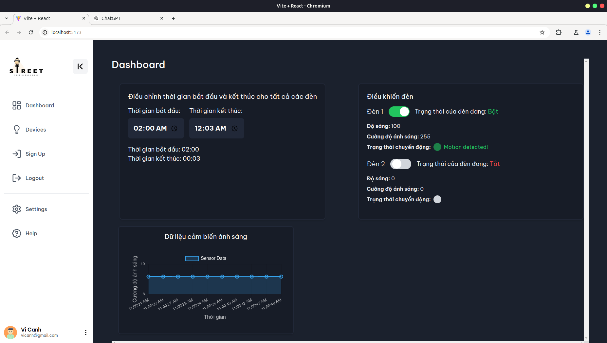
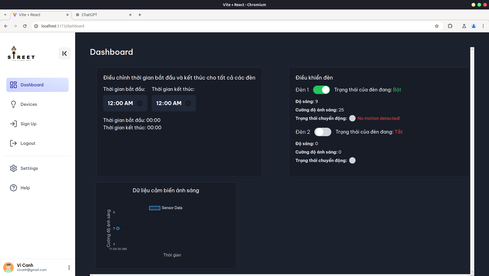
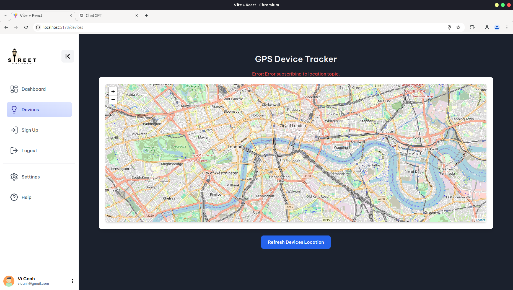
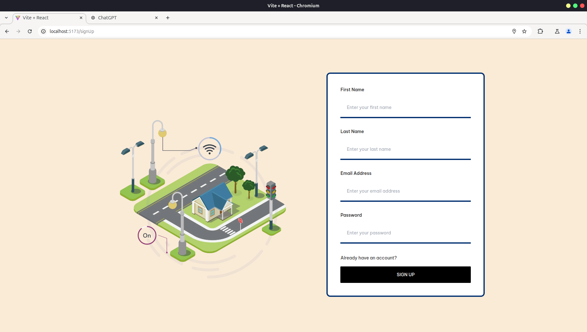
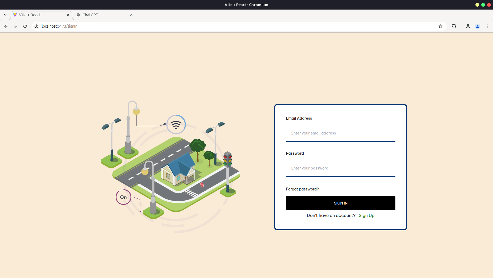

# iot-street-lighting

## Hướng dẫn cách chạy Frontend

1. Mở terminal và điều hướng đến thư mục uiStreetLighting
```
cd front-end/uiStreetLighting
```

2. Cài đặt các dependencies cần thiết:
```
npm install
```
3. Chạy ứng dụng ở chế độ phát triển
```
npm run dev
```
4. Truy cập được link local: http://localhost:5173

## Hướng dẫn cách chạy Backend

Trước khi chạy BE yêu cầu bật Docker desktop, trong package.json và docker-compose.yml đã setup sẵn docker để sử dụng rabbitMQ. Server chạy trên port 8087

NOTE: Nếu không chạy docker desktop thì sẽ bị lỗi ko gọi được docker dưới terminal

1. Tải dependency cho project
```
npm i --force
```

2. Chạy project dưới terminal
```
npm start
```

## Các Route API

#### Login: http://localhost:8087/api/v1/signin

#### SignUp: http://localhost:8087/api/v1/signup

#### change Light: http://localhost:8087/api/v1/changeLight

#### change schedule: http://localhost:8087/api/v1/changeSchedule

#### change brightness: http://localhost:8087/api/v1/changeBrightness


## Kết quả dự án

1. Giao diện










